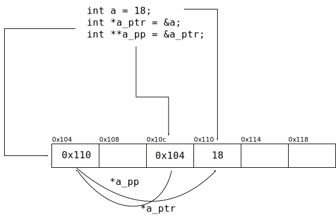

##########
数组与指针
##########

数组
====

为了存储多个相同类型的数据, 出现了 *数组(Array)* 这样的数据结构.
一个数组是一块连续的内存空间, 其大小足以容纳规定数目的元素.
在划分出空间后, 此空间的大小与位置不再变化.

在定义数组时, 需要设定数组的大小与类型,
例如, 定义一个 10 个元素大小的 int 数组::

   int array[10];

在旧的 C 标准(C89) 中, 定义数组时, 数组的长度必须是一个在编译期间能确定的常量,
例如字面量或静态存储的 const 常量. 而在 C99 之后,
允许使用 *变长数组(Variable Length Array)*, 简称 VLA,
这里的 "变长" 不是指长度可变, 而是说可以用运行时才确定的 **变量** 来设置数组的长度.

数组在定义时不会被初始化, 需要显式初始化, 可以使用一个初始化列表::

   int array[10] = {1, 2, 3};

当存在显式初始化时, 数组将从头到尾一一设置为初始化列表中的值,
如果初始化列表太短, 则剩下的位置将被置零.

上面的 array 被初始化后的值为::

   1, 2, 3, 0, 0, 0, 0, 0, 0, 0

要访问一个数组中的元素, 可以使用下标语法::

   array[2]; // 得到 3

需要注意的是, 下标从 0 开始.

可以在定义数组时提供初始化列表但省略数组长度::

   int array[] = {1, 2, 3};

这将定义一个长度为 3, 具有初始值 1, 2, 3 的 int 类型数组.

字符串
======

字符串是一个用 ``0x00`` (常用转义序列 ``\0`` 表示) 结尾的字符数组.

多维数组
========

可以定义多维数组::

   int array[4][3] = {
      {0, 1, 2},
      {3, 4, 5},
      {6, 7, 8},
      {9, 10, 11}
   }

::

   int array[/* 第一维长度 */][/* 第二维长度 */];

多维数组必须给定每一维度的长度.

可以通过下标访问::

   array[3][3]; // 8

::

   array[/* 第一维坐标 */][/* 第二维坐标 */];

多维数组的内存分配是按照先行规律进行分配的.
所有的数组实际上在内存中都是一维存储, 但是根据定义时确定的大小, 能够将其划分为不同的部分:

   show.2darray.svg

同样地, 可以定义 3 维, 4 维 数组. 不过高维数组太过抽象, 使用起来太过困难,
在遇到这种情形时, 需要考虑降维.

.. _`指针`:

指针
====

指针是一种存储了内存地址的变量.
普通的变量表示一块存储数值的内存区域, 指针也是.
不过指针所表示的内存区域中存储的值比较特殊, 是一个内存地址.

可以将内存想象为棋盘, 在格子中存储了数据, 每一个格子都按照从 0 到 n 的顺序编上号码,
这个号码就是地址, 可以通过地址找到确定的格子.
用变量表示一个格子, 则指针变量所表示的格子中存储了能用于找到另一个格子的地址.
指针的大小为一个 CPU 的字长. 字长也就是 CPU 寄存器的大小, 它决定了 CPU 能够操作多大的值.
对应到指针, 也就限制了 CPU 能 "够得着" 多远处的内存.

指针也具有类型, 虽然所有指针的大小都是一样的一个字长大小,
但是指针的类型决定了它所指向的数据的解读方式.

声明一个指针类型的变量, 需要使用对应的类型名并在变量名前添加一个 ``*`` 号::

   int *a_ptr;

如果使用逗号表达式, 则需要在每一个要声明的指针变量前使用星号::

   int *a, *b, c;

否则, 对应的变量就会被声明为普通的变量.
上例中, ``a``, ``b`` 是 int 的指针变量, 而 ``c`` 是普通变量.

使用 ``&`` 引用操作符得到一个实体的地址::

   int a = 18;
   int* a_ptr = &a;

而用 ``*`` 解引用操作符访问对应的内存::

   *a_ptr   // 这个表达式的值为 18

   intro.pointer

指针运算
========

指针的运算, 就是进行指针的移动. 它只能进行加法或减法, 加法就是向后移动, 减法就是向前.
一次移动的单位是指针解引用后的类型的长度.

例如::

   int a = 18;
   int *a_ptr = &a;
   a_ptr += 1;

指针的移动如图:

   show.pointer.move

多维指针
========

指针同样可以指向指针::

   int a = 18;
   int *a_ptr = &a;
   int **a_pp = &a_ptr;

   intro.pointer.2d

如果要从二维指针直接解引用到最后的变量, 可以连续使用解引用操作符::

   **a_pp // 18

也可以定义更高维度的指针. 不过和多维数组类似, 维度越高越难想象.

.. _`void 指针`:

void 指针
=========

和确定类型的指针不同, void 指针可以指向任何位置.
但是, 由于不知道解引用后的类型, void 指针不能参与指针运算或解引用.

通常用在函数的形参或者返回值上, 在得到结果后先进行显式类型转换, 再参与指针运算或解引用.

.. _`常量指针与指针常量`:

常量指针与指针常量
==================

用 const 修饰指针可能有两种用例:

1. 指针不能指向其他位置
2. 不能修改指针所指向的值

前者 ``const`` 在前, 称为常量指针::

   const int *ptr;

后者 ``const`` 在后, 称为指针常量::

   int *const ptr;

或者同时使用::

   const int *const ptr;

指针与数组的关系
================

定义一个数组::

   int array[3] = {1, 2, 3};

定义一个指针::

   int *array_p = array;

数组名其实就是一个常量指针, 它不能被修改(指向其他位置).
当下标访问时, 会被编译为指针解引用的形式::

   array[2] // *(array + 2)

由于加法满足交换律, 这样的语法也是可以通过编译的::

   2[array] // *(2 + array)

在 `常量指针与指针常量`_ 中, 提到了常量指针不能被指向其他位置, 同样的, 数组名也不能被修改.

数组和指针也存在区别, 当使用 sizeof 运算符时, 操作数组将会得到整个数组的大小 (单位: 字节),
而操作指针, 只会得到这个指针变量的大小.

.. literalinclude:: _code/test.sizeof.c
   :language: c
   :caption: test.sizeof.c
