####
函数
####

函数的声明与定义
================

函数和变量类似, 可以进行声明或定义. 在进行声明时, 需要提供函数的返回类型, 函数名和函数的形参表.
声明时的形参表可以只设置类型, 而不设置形式参数的名称::

   void swap(int *, int *);

   /* 返回类型 */ /* 函数名 */(/* 形参表 */);

在定义时, 除了提供以上三者之外, 还需要提供函数体, 并且, 形参必须命名::

   void swap(int *a, int *b)
   {
      int tmp;
      tmp = *a;
      *a = *b;
      *b = tmp;
   }

   /* 返回类型 */ /* 函数名 */(/* 命名形参表 */)
   {
      /* 函数体 */
   }

关于函数的参数, 存在两种称呼: *形式参数(Parameter)* 和 *实际参数(Argument)*.

所谓的形式参数, 就像变量名一样, 是函数执行时定义的变量标识符.
而实际参数则是指调用函数时由调用者传递给被调用函数的变量, 有 "已经存储了值的变量" 的意思.

和其他标识符一样, 函数也必须先声明, 后调用.

错误::

   #include <stdio.h>
   int main(void) {
      hello();    // 找不到符号 hello
      return 0;
   }

   void hello(void) {
      printf("Hello World\n");
   }

正确::

   #include <stdio.h>
   void hello(void) {
      printf("Hello World\n");
   }
   int main(void) {
      hello();
      return 0;
   }

将声明与定义分离也是正确的::

   #include <stdio.h>
   void hello(void);

   int main(void) {
      hello();
      return 0;
   }

   void hello(void) {
      printf("Hello World\n");
   }

返回值
   函数在运行后, 能够向调用位置返回一个值. 这个值的类型需要在声明时指定.
   在函数体中, 使用 ``return`` 关键字返回结果.

函数名
   函数名也是一种标识符.
   一个函数, 在可执行文件中对应了一段只读的数据, 这段数据就是函数将执行的机器码.

   因此, 函数名也可以被引用, 详见 `函数指针`_.

形参表
   形参表决定了函数调用时可以接受的参数以及它们的类型.
   在函数的声明中, 参数的名称是无意义的, 可以省略, 也可以设置,
   不过, 在函数的定义处, 形参的名字可以被重新设置.

   一个函数, 将由 返回值类型、函数名、形参类型 唯一确定.

函数体
   函数将执行的指令.

函数帧
======

函数帧是当函数被调用时, 在栈上创建的一片内存区域.
这个栈又被称为 "帧栈" 或 "调用栈".
这个区域中存储了该函数的作用域中定义的变量以及它们的符号.
帧在函数执行时被创建, 在函数结束时被销毁.

.. code-block:: c
   :linenos:

   void swap(int *a, int *b)
   {
      int tmp = *a;
      *a = *b;
      *b = tmp;
   }

   int main(void)
   {
      int a = 1;
      int b = 2;
      swap(&a, &b);
      return 0;
   }

main 函数的形参设为 :c:type:`void`,
在函数体中定义了 a, b 两个 :c:type:`int` 型变量.
因此, main 函数的帧上分配了两个 int 型变量的值.

在函数 swap 中, 定义了两个 ``int *`` 型的指针 ``a``, ``b``,
而在函数体中定义了一个 :c:type:`int` 型的变量 ``tmp``.
在 swap 函数的帧上分配了这三个变量的空间.

程序从 main 函数的起点开始, 当运行到 ``swap(&a, &b);`` 语句时,
调用了这个函数, 具体的流程如下:

   show.frame.function

1. 创建了一个新的帧, 其大小可以储存两个 ``int *`` 和一个 :c:type:`int`.
2. 这个帧被追加到帧栈上属于 main 函数的帧之后.
3. 从 main 函数的帧上取到变量 a, b 的地址,
   将其复制到 swap 帧上 ``int *a`` 和 ``int *b`` 对应的空间处.
4. 由于 ``int tmp`` 是在运行时才赋值, 在调用时仅分配空间但不初始化.
5. 运行函数体.
6. 函数运行结束. 返回返回值(如果有), 之后销毁当前帧.

参数的值传递与引用传递
======================

正如 `函数帧`_ 中所描述的. 在调用函数时, 会将传入的参数 **复制** 到帧中,
而在函数执行结束后, 销毁函数的帧.
因此, 函数中的变量, 和传递的实际参数并非同一个实体.
C 语言中的函数都是 "值传递" 的.

引用传递则是传递一个指针.
被调用的函数可以通过这个指针找到上级函数帧中的变量, 并对它进行修改.

引用传递实际上也是值传递, 只不过这个值是一个指针罢了.
当函数的帧被销毁, 这个指针也被销毁. 但由于指针所指向的位置在帧的外面,
因此修改可以被保存下来.

如果将 swap 函数的形参修改以下, 不再传递指针::

   void swap(int a, int b);

那么, 在 main 函数中的 变量 a, b 在调用 swap 之后, 值仍然是 1, 2.

函数指针
========

如同 `函数的声明与定义所述`_, 函数名本身也是一个标识符, 表示一个可执行机器码的内存空间.
因此, 函数名可以被指针引用, 甚至作为参数传递给函数使用.

一个函数的指针

.. _`常量函数`:

常量函数
========
