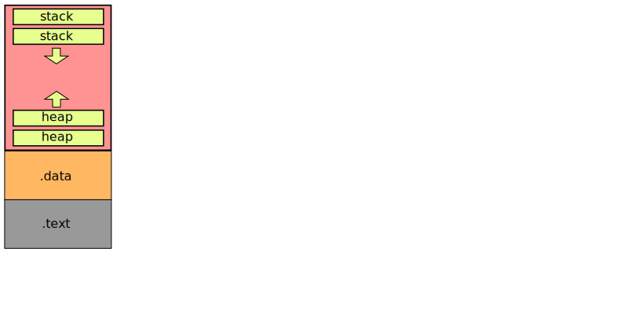

.. _`作用域`:

######
作用域
######

.. todo::

   要理解作用域,
   需要了解可执行文件的结构以及帧栈的概念.

首先, 让我们来了解一下单进程单线程的程序在运行时是什么状况.

编译得到的可执行文件称为 *镜像(Image)*, 在运行时, 一个程序会创建一个进程, 它所占用的内存空间被称为 *进程地址空间*

镜像中, 会存储程序的数据段, 在加载到内存中运行时会新增会动态改变的空间.
镜像中的 "段" 也被称为 *节(Section)*.

内存布局
========

程序运行时被加载到内存中, 可以被分为几个数据 *段(Segment)*:

.text (Code/Text Segment)
   代码段. 此段中存储了可被执行的机器码.

.rodata (Read-Only Data Segment)
   只读数据段. 被 const 修饰的具有静态存储类型的变量将在此段中存储.

.rwdata (Read-Write Data Segment)
   已初始化可读写数据段. 具有静态存储类型且被初始化的变量将在此段中存储.

.bss (Block Started by Symbol)
   未初始化数据段. 具有静态存储类型且未被初始化(只声明)的变量将在此段中存储.
   此段将在运行时分配空间.
   extern 修饰的变量将在链接步骤被重新定位,
   不一定就处于 .bss 段.

heap
   堆. 在运行时分配空间.

stack
   栈. 在运行时分配空间.

其中, ``.text``, ``.rodata``, ``.rwdata`` 以及 ``.bss`` 四个段属于静态存储区.
``.text``, ``.rodata``, ``.rwdata`` 三个段在可执行文件中保存为对应的节 . 而 ``heap`` 和 ``stack`` 则不会在文件中保存, 只在运行时才分配空间.

在代码不同位置声明/定义的变量的存储类型大致如下:

.. literalinclude:: _code/show.memory.c
   :language: c
   :linenos:

1. 函数编译得到的机器码将被存储在 ``.text`` 节
2. 被初始化的 static 变量存储在 ``.rwdata`` 节
3. 被 const 修饰且初始化的 static 变量存储在 ``.rodata`` 节
4. 程序中使用的字面量也存储在 ``.rodata`` 节

.. note:: 静态存储类型的未初始化变量, 将位于 ``.bss`` 段中,
   这个段不会保存在可执行文件中, 只有运行时在内存中创建.

当程序运行起来后, ``.text``, ``.*data`` 节都被加载到内存中,
被加载到内存后, 称其为 "段",
并且, 会创建以下段:

1. ``.bss`` 段. 这个段也是静态的, 在程序一开始就分配空间, 而在函数调用时修改其中的值.
2. ``heap`` 与 ``stack``. 这两个段将在程序启动时分配到同一个段中, 此段具有确定的大小.
   在程序运行过程中, 段的容量不会改变,
   而其中 stack 和 heap 的大小会发生变化.



   典型内存布局

变量的存储类型与生存周期
========================

我们可以把一个变量分成两个部分： 名字（标识符）和实例（实际存储的值）。
在程序中，一个名字代表了一个存储在内存中的值。
名字受到作用域的限制，而实例根据其所在位置的不同，具有不同的生存周期。

实例的 *生存周期(Life Cycle)* 指的是此变量的值存储在内存中，可以被使用的一段时期.
在栈上的实例, 其生存周期与名字一致，当作用域结束时将被一同释放，
在堆上的实例, 其生存周期受手动控制，与名字的可用性无关。

例如，在 C 语言中，一个基本的声明，将会创建一对名字与实例，实例被分配在栈上：

```c
int main(void) {
   int x = 1;
   printf("%d\n", x);
   {
      int x = 2;
      printf("%d\n", x);
   }
   printf("%d\n", x);
   return 0;
}
```

名字具有遮蔽效应。在内层作用域中的同名变量，将会 **遮蔽** 外层作用域中的变量。
但外层作用域的变量并没有消失或被修改。当内存作用域结束后，外层作用域中的同名变量被暴露出来，
就可以继续使用了。
在上面的例子中，程序将会输出

```
1
2
1
```

由于在栈上分配的实例会随着栈被释放，所以在函数间传递指针时，不应当向调用函数传递被调用函数中定义的数据的指针，
这将访问到非法地址：

```c
int *hello(void) {
   int x = 1;
   return &x;
}
int main(void) {
   int *x = hello();
   printf("%d\n", *x);
   return 0;
}
```

相信编译器也会对此提出警告的。

各种基本类型、结构体、数组等默认都是分配在栈上的。要将它们分配到堆中，
则需要使用 :doc:`/standard-lib/c/stdlib` 中的
:func:`malloc` 、 :func:`calloc` 与 :func:`free` 函数
来手动管理内存。

malloc 用于分配一片内存，而 calloc 将会分配一个数组， free 则是释放这些被分配的内存。

由于名字的作用域和堆中实例的生存周期无关，所以堆中的内存常常面临这些安全问题：

1. 分配而不释放，造成资源大量被无用数据占用，即内存泄露
2. 重复释放，属于未定义行为，后果不可知，可能导致程序崩溃

要解决这些常见的内存安全问题, 需要程序员采用合理的编程模式以规避之.
例如

- RAII 资源分配即初始化策略

作用域分级
----------

对于一个 C 文件, 可以分为全局作用域, 函数作用域, 块作用域三个等级.
它们在语法上具有一个共同特征, 就是使用 *花括号(braces)* ``{}`` 进行界定.

全局作用域上的数据, 默认存储在程序的 静态存储区, 在程序的整个运行期间一直存在;
函数作用域上的数据, 会存储在随着函数调用而产生的栈帧上, 生存周期与函数帧一致;
而块作用域上的数据, 也存储在函数的栈帧上, 只是名字会因为退出作用域而不可用.

即, 只有函数作用域的进入与退出会导致栈帧的变化.
块级作用域上的数据, 虽然也具有在作用域外无法访问的性质,
但是没有新的帧产生, 它的存储位置和函数作用域是一致的.
